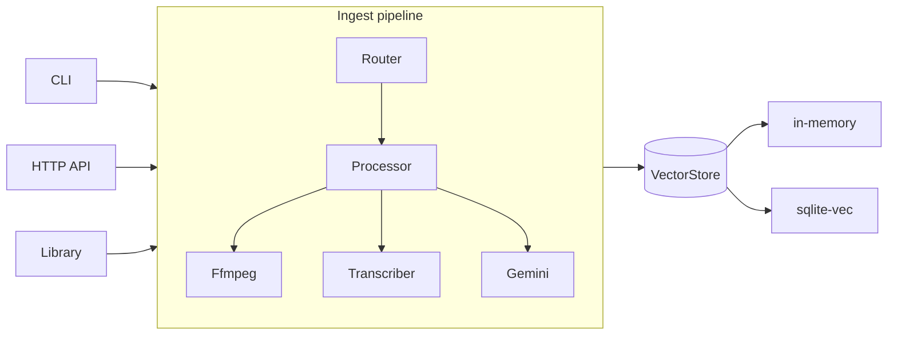

# upload-world

## What this is

**upload-world** is a multimodal ingest pipeline: throw any file at it — text, audio, video, image, PDF — and it is normalized to text, embedded with Gemini embeddings, and stored in a pluggable vector store. See the [README](../README.md) for the pitch and quickstart; this wiki adds navigation and synthesis over the source.

It is built with TypeScript 7 (`tsgo`) and the **Effect** ecosystem, library-first: every stage is an Effect service behind a `Context.Tag`, wired with Layers (see [Effect layers](./concepts/effect-layers.md)). The same core drops into a CLI, an HTTP API, or your own program, and every stage — [media conditioning](./modules/ffmpeg.md), [transcription](./modules/transcriber.md), [model provider](./modules/gemini.md), [vector store](./modules/vector-store.md) — is swappable. The whole thing runs offline with no API key thanks to a deterministic [mock-first](./concepts/mock-first.md) design.

## Architecture at a glance

Three delivery surfaces (CLI, HTTP, library) call the same [pipeline](./modules/pipeline.md): the [Router](./concepts/media-kind.md) detects the modality, the [Processor](./modules/processor.md) normalizes it to text [chunks](./concepts/chunking.md) (conditioning media through [ffmpeg](./modules/ffmpeg.md) first), [Gemini](./modules/gemini.md) turns the chunks into [embeddings](./concepts/embeddings.md), and a [VectorStore](./modules/vector-store.md) persists and searches them.

## Navigation

### Architecture

- [Effect service architecture](./architecture/service-layers.md) — the five service seams and how Layers wire them
- [Delivery surfaces](./architecture/delivery-surfaces.md) — one typed API, exposed as CLI, standalone server, web handler, and Effect Layer

### Modules

- [Pipeline](./modules/pipeline.md) — ingest/search orchestration (`ingestData`, `ingestPaths`, `search`)
- [CLI](./modules/cli.md) — `ingest` / `search` / `status` / `serve` commands
- [HTTP API](./modules/http-api.md) — typed endpoints, error mapping, turn-key wiring
- [Processor](./modules/processor.md) — per-modality normalization to text chunks
- [Gemini](./modules/gemini.md) — the single seam to Google: describe, extract, embed (live + mock)
- [Ffmpeg](./modules/ffmpeg.md) — mandatory media-conditioning stage
- [Transcriber](./modules/transcriber.md) — speech-to-text seam: whisper.cpp, OpenAI, Gemini
- [Vector store](./modules/vector-store.md) — pluggable persistence: in-memory and SQLite + sqlite-vec

### Flows

- [Ingest a file](./flows/ingest.md) — read → route → normalize → embed → store
- [Search](./flows/search.md) — query → embed → k-nearest chunks
- [Video processing](./flows/video-processing.md) — key frames + audio track, described and transcribed in parallel

### Concepts

- [Effect layers](./concepts/effect-layers.md) — `Context.Tag` services and Layer composition
- [Chunking](./concepts/chunking.md) — boundary-aware text splitting with overlap
- [Media kind](./concepts/media-kind.md) — extension-based modality routing
- [Embeddings](./concepts/embeddings.md) — Gemini Embedding 2, MRL dimensions, cosine scores
- [Mock-first](./concepts/mock-first.md) — the full pipeline works with no API key

### Guides

- [Bring your own vector store](./guides/bring-your-own-vector-store.md)
- [Support a new file type](./guides/support-a-new-file-type.md)
- [Swap the transcriber](./guides/swap-the-transcriber.md)

Generation history lives in the [wiki log](./log.md).