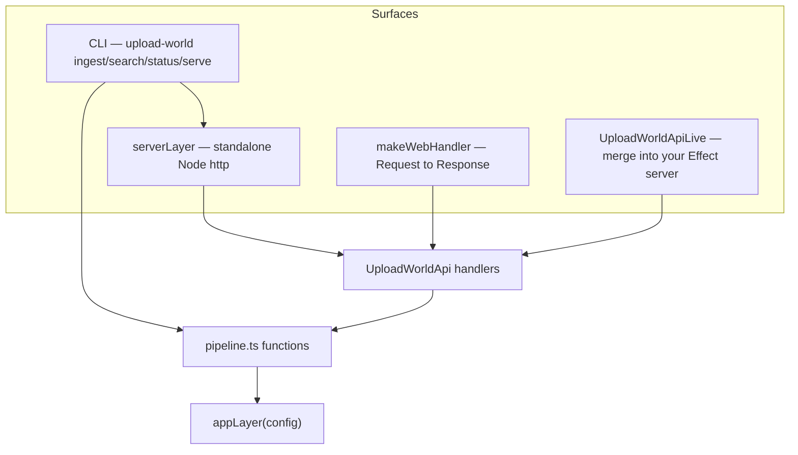

# Delivery surfaces

## Summary

upload-world is library-first: the [pipeline](../modules/pipeline.md) and the typed [HTTP API](../modules/http-api.md) are plain Effect values, and four thin surfaces launch them. All four share `appLayer(config)` from [server.ts](../../src/server.ts), so behavior (store choice, mock fallback, transcriber selection) is identical everywhere.

## Diagram

## Key components

- **CLI** — [cli.ts](../../src/cli.ts) builds `ingest` / `search` / `status` / `serve` subcommands with `@effect/cli` and provides `appLayer` per invocation. `serve` just launches `serverLayer`. Details: [CLI module](../modules/cli.md).
- **Standalone server** — `serverLayer({ port, … })` in [server.ts](../../src/server.ts) stacks `HttpApiBuilder.serve()` with Swagger docs at `/docs` on a Node `http` server. `Layer.launch` and you're live.
- **Web-standard handler** — `makeWebHandler(config)` returns `{ handler, dispose }` where `handler` is `(Request) => Promise<Response>` — mountable in Express, Hono, Fastify, Next.js, Bun, Deno, or a Lambda. `dispose` releases the store on shutdown.
- **Effect Layer** — `UploadWorldApiLive` is the API + handlers as a Layer needing `Gemini | Processor | VectorStore | FileSystem`; merge it into an existing `HttpApiBuilder.serve()` stack.
- **Library** — skip HTTP entirely: import `ingestPaths` / `search` from [index.ts](../../src/index.ts) and provide your own Layer stack, as shown in the [README](../../README.md).

## Design decisions

- **One API definition, many transports** — the endpoints are declared once in [api.ts](../../src/api.ts) as an `HttpApi` schema; OpenAPI docs, the web handler, and the standalone server all derive from it. No route duplication.
- **`appLayer` as the single composition root** — every surface funnels through the same config-to-layers function, so a flag like `--mock` or a missing `GEMINI_API_KEY` behaves identically in CLI and HTTP (see [Mock-first](../concepts/mock-first.md)).
- **Web handler for portability, Layer for composability** — `makeWebHandler` trades Effect-native composition for a fetch-standard signature; `UploadWorldApiLive` is the reverse. Both exist so integrators pick their coupling level.

## Related

- [Effect service architecture](./service-layers.md)
- [HTTP API module](../modules/http-api.md)
- [CLI module](../modules/cli.md)
- [Ingest flow](../flows/ingest.md)