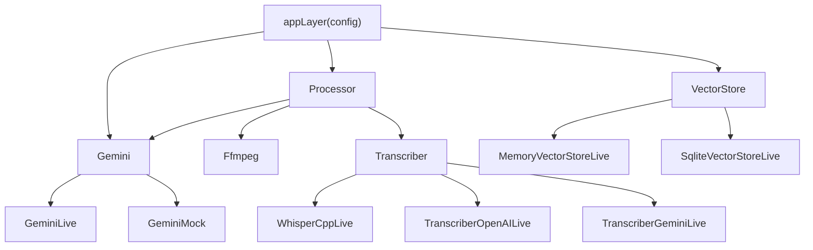

# Effect service architecture

## Summary

Every stage of the pipeline is an Effect service: an interface published behind a `Context.Tag`, implemented by one or more interchangeable Layers (see [Effect layers](../concepts/effect-layers.md)). Business logic — the [pipeline](../modules/pipeline.md), the [HTTP handlers](../modules/http-api.md), the [CLI](../modules/cli.md) — depends only on the tags; which implementation runs is decided once, at the edge, by Layer composition.

There are five seams:

| Seam | Tag file | Implementations |
|---|---|---|
| `Gemini` | [Gemini.ts](../../src/services/Gemini.ts) | `GeminiLive` (REST), `GeminiMock` (offline) |
| `Processor` | [Processor.ts](../../src/services/Processor.ts) | `ProcessorLive` |
| `Ffmpeg` | [Ffmpeg.ts](../../src/services/Ffmpeg.ts) | `FfmpegLive` (real binary), `FfmpegMock` |
| `Transcriber` | [Transcriber.ts](../../src/services/Transcriber.ts) | `WhisperCppLive`, `TranscriberOpenAILive`, `TranscriberGeminiLive`, `TranscriberMock` |
| `VectorStore` | [VectorStore.ts](../../src/services/VectorStore.ts) | `MemoryVectorStoreLive`, `SqliteVectorStoreLive` |

## Diagram

## Key components

- **Interface files** — each seam is a small file exporting the service interface and its `Context.Tag` (e.g. the `GeminiService` interface and `Gemini` tag in [Gemini.ts](../../src/services/Gemini.ts)). They import only from [domain.ts](../../src/domain.ts), so consumers never touch implementation dependencies.
- **Live layers** — implementations live in sibling files ([GeminiLive.ts](../../src/services/GeminiLive.ts), [FfmpegLive.ts](../../src/services/FfmpegLive.ts), …) and declare their own requirements in their Layer type: `GeminiLive` needs an `HttpClient`, `FfmpegLive` needs `CommandExecutor | FileSystem | Path`.
- **`appLayer(config)`** — the composition root in [server.ts](../../src/server.ts). From a plain config object it picks Gemini live-or-mock (falling back to mock when `GEMINI_API_KEY` is unset — see [Mock-first](../concepts/mock-first.md)), the store backend, the ffmpeg layer, and the transcriber backend, then merges everything the handlers need. Any of the five seams can be overridden by passing a custom Layer in `AppConfig`.
- **Domain types and errors** — [domain.ts](../../src/domain.ts) holds the shared vocabulary (`IngestSource`, `Chunk`, `EmbeddedChunk`, `SearchHit` — see [Chunking](../concepts/chunking.md)) and four tagged errors (`UnsupportedMediaError`, `GeminiError`, `ProcessingError`, `VectorStoreError`) that every seam speaks.
- **Config** — [config.ts](../../src/config.ts) declares all environment configuration as Effect `Config` values (`GEMINI_API_KEY`, model names, embedding dimension, ffmpeg/whisper binaries).

## Design decisions

- **Tags over constructors** — consumers state *what* they need in their Effect type (`Gemini | Processor | VectorStore`), and the compiler enforces that a Layer provides it. Swapping a provider is a one-line Layer change; nothing downstream recompiles differently.
- **Interface/implementation file split** — keeps the dependency graph honest: `ProcessorLive` depending on `Ffmpeg` is visible in its Layer type, not hidden in an import.
- **Mock layers are first-class** — `GeminiMock`, `FfmpegMock`, `TranscriberMock` ([mocks.ts](../../src/services/mocks.ts)) make the full pipeline deterministic and offline, which is both the test strategy and the keyless demo path.
- **Everything re-exported** — [index.ts](../../src/index.ts) exposes all tags, layers, and pipeline functions so library users compose their own stack.

## Related

- [Delivery surfaces](./delivery-surfaces.md) — where these layers get launched
- [Effect layers](../concepts/effect-layers.md) — the concept in isolation
- [Mock-first](../concepts/mock-first.md)