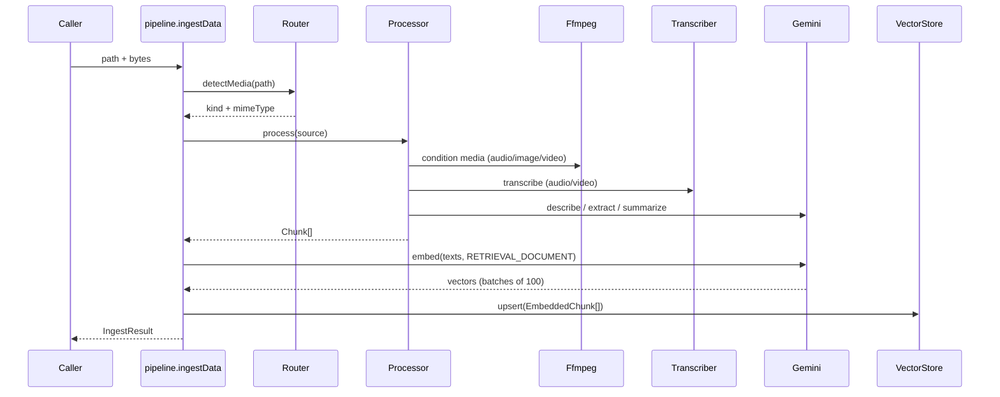

# Ingest a file

## Summary

Every ingest — CLI, HTTP multipart, HTTP raw bytes, or library call — converges on `ingestData` in the [pipeline](../modules/pipeline.md): route the file to a [media kind](../concepts/media-kind.md), normalize it to text [chunks](../concepts/chunking.md), embed the texts, and upsert.

## Trigger

`upload-world ingest <paths…>` ([CLI](../modules/cli.md)), `POST /ingest` / `POST /ingest/raw` ([HTTP API](../modules/http-api.md)), or `ingestPaths` / `ingestPath` / `ingestData` as a library.

## Sequence diagram

## Steps

1. **Collect** — `ingestPaths` walks directories recursively (dotfiles skipped); unreadable paths go straight to `skipped`.
2. **Route** — `detectMedia` ([Router.ts](../../src/services/Router.ts)) maps the extension to a kind + MIME type; unknown extensions are skipped with the supported list in the reason.
3. **Normalize** — the [Processor](../modules/processor.md) runs the per-modality strategy (conditioning media through [ffmpeg](../modules/ffmpeg.md) first) and emits chunks whose ids are `{sha256[:16] of bytes}:{index}`.
4. **Embed** — chunk texts are embedded via [Gemini](../modules/gemini.md) with `RETRIEVAL_DOCUMENT` intent, 100 per batch ([Embeddings](../concepts/embeddings.md)).
5. **Store** — `upsert` into the [vector store](../modules/vector-store.md); re-ingesting the same bytes replaces its chunks by id.
6. **Report** — files ingest with concurrency 4; each outcome becomes a result or a `skipped` entry — the batch never fails as a whole.

## Failure modes

- Unsupported extension → `UnsupportedMediaError` (HTTP 415 on `/ingest/raw`; `skipped` in batches).
- Bad file (invalid UTF-8, ffmpeg failure, >19 MB PDF, empty transcript) → `ProcessingError` (422).
- Gemini upstream failure after 3 transient retries → `GeminiError` (502).
- Store failure (e.g. embedding dimensionality mismatch) → `VectorStoreError` (500).

## Related

- [Search flow](../flows/search.md) · [Video processing](../flows/video-processing.md) · [Delivery surfaces](../architecture/delivery-surfaces.md)