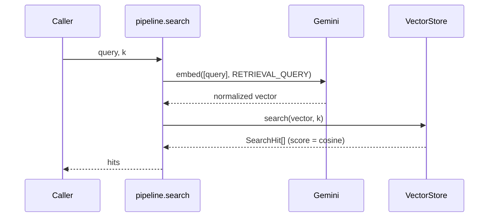

# Search

## Summary

Search is two calls: embed the query, then k-nearest-neighbours in the store. All the intelligence is in ingest-time normalization — search itself stays tiny (`search` in [pipeline.ts](../../src/pipeline.ts)).

## Trigger

`upload-world search "query" -k 5` ([CLI](../modules/cli.md)), `GET /search?q=&k=` ([HTTP API](../modules/http-api.md)), or the `search` library function.

## Sequence diagram

## Steps

1. **Embed the query** — with `RETRIEVAL_QUERY` intent: on Gemini Embedding 2 that becomes the prompt prefix `task: search result | query: …` (documents embed raw); on the legacy model it is the `taskType` param. See [Embeddings](../concepts/embeddings.md).
2. **kNN** — the [vector store](../modules/vector-store.md) returns the k nearest chunks by cosine similarity: brute-force scan in memory, vec0 `MATCH` in sqlite (score = `1 - distance`).
3. **Present** — the CLI prints score/path/kind/snippet; the HTTP layer flattens hits via `toWireHit` in [server.ts](../../src/server.ts).

## Failure modes

- Gemini failure → `GeminiError` (HTTP 502).
- Store failure or dimensionality mismatch (e.g. store built with a different `UPLOAD_WORLD_EMBEDDING_DIM`) → `VectorStoreError` (500).
- Empty store → empty results, not an error (the CLI hints “ingest something first?”).

## Related

- [Ingest flow](../flows/ingest.md) · [Mock-first](../concepts/mock-first.md) (mock queries only match mock-ingested content usefully)