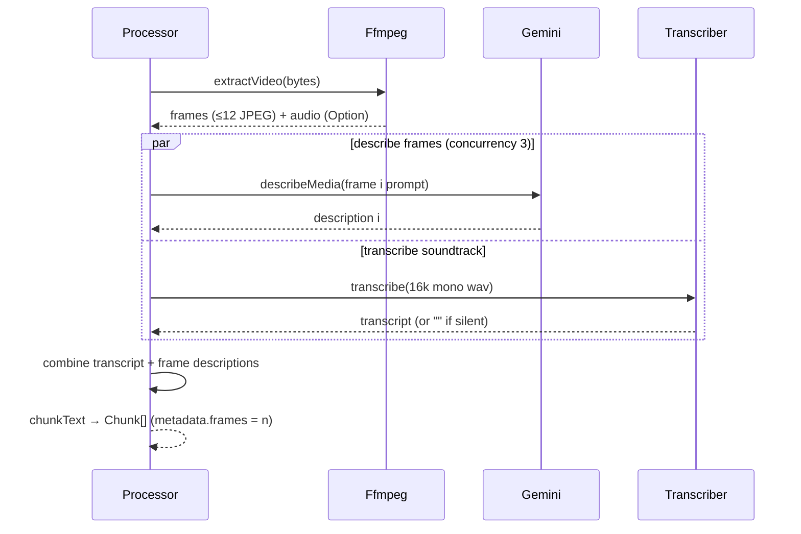

# Video processing

## Summary

Video is the richest branch of the [Processor](../modules/processor.md): [ffmpeg](../modules/ffmpeg.md) splits the file into scene-detected key frames plus a conditioned audio track, then frame descriptions and the transcript are produced **in parallel** and merged into one text before [chunking](../concepts/chunking.md).

## Trigger

Any ingest of a video extension (`.mp4` `.mov` `.webm` `.mkv` `.avi` — see [Media kind](../concepts/media-kind.md)).

## Sequence diagram

## Steps

1. **Extract** — `extractVideo` in [FfmpegLive.ts](../../src/services/FfmpegLive.ts): scene-change select (threshold 0.30, frame 0 always included), ≤12 frames at ≤1024 px JPEG; static footage falls back to 1 fps sampling. The audio track gets the standard speech conditioning and is optional — silent videos proceed without it.
2. **Describe + transcribe in parallel** — each frame goes to [Gemini](../modules/gemini.md) `describeMedia` with a “key frame i of n” factual prompt, 3 frames concurrently; the soundtrack goes to the [Transcriber](../modules/transcriber.md). Both sides run with `Effect.all` concurrency 2.
3. **Combine** — `Transcript:\n…` + `Key frames:` + `Frame i: …` sections joined; empty parts dropped.
4. **Chunk** — the combined text is chunked; every chunk carries `metadata.frames` with the frame count.

## Failure modes

- No frames extractable → `ProcessingError` (“ffmpeg extracted no frames from video”).
- Missing audio track → not an error: transcript is simply empty.
- Any frame description failing (after retries) fails the file with a `GeminiError` — it lands in `skipped` for batch ingests.

## Related

- [Ingest flow](../flows/ingest.md) · [Ffmpeg](../modules/ffmpeg.md) · [Transcriber](../modules/transcriber.md)